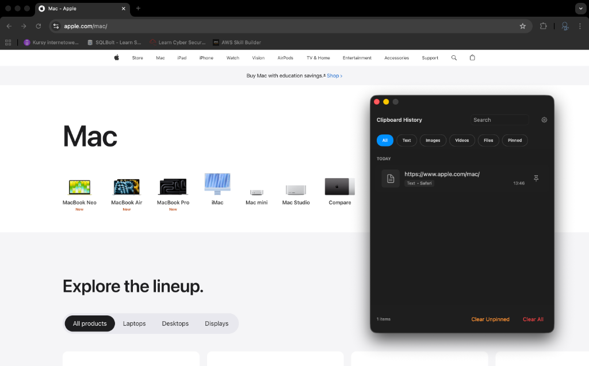
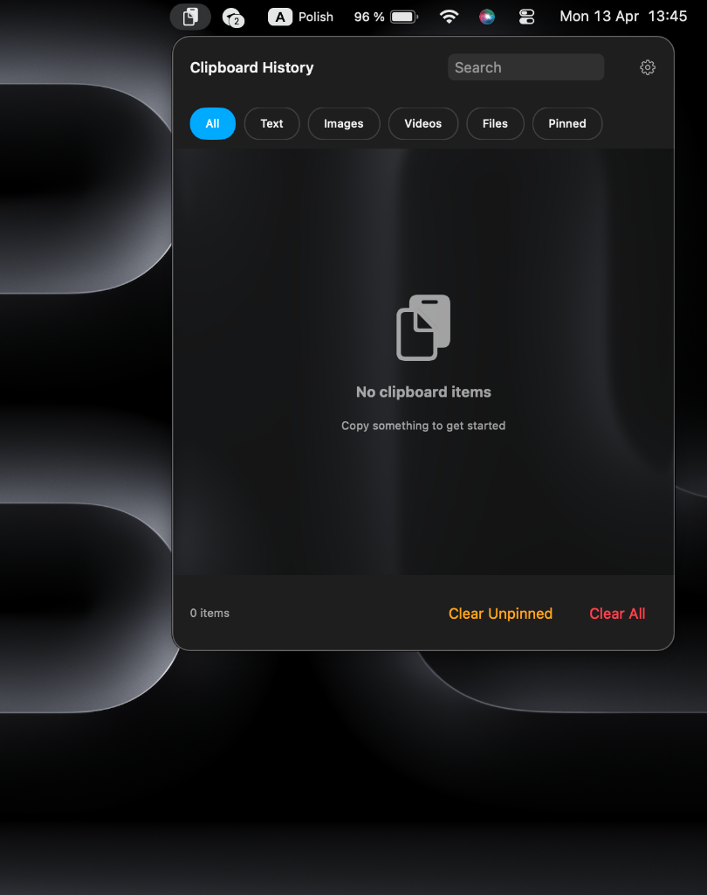
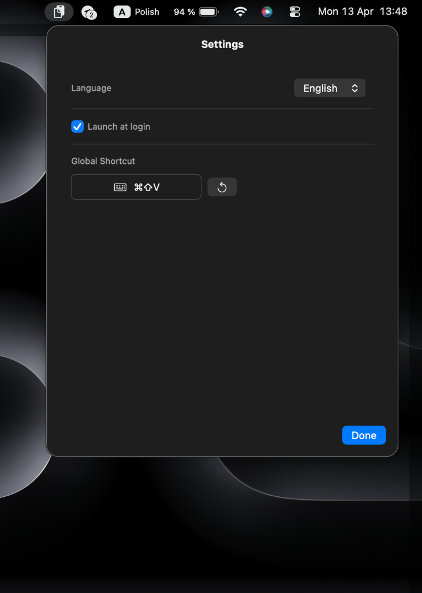

# Buffer

<div align="center">

**A powerful, privacy-focused clipboard manager for macOS**

[](https://swift.org)
[](https://www.apple.com/macos)
[](LICENSE)

*Streamline your workflow with intelligent clipboard history management*

</div>

---

## 🎯 Overview

Buffer is a native macOS application that enhances your productivity by maintaining a comprehensive history of your clipboard operations. Built with SwiftUI and designed with privacy in mind, Buffer provides an elegant, keyboard-driven interface for accessing your clipboard history without compromising your data security.

### Key Highlights
- **🔒 Privacy-First**: All data stored locally, no network access.
- **⚡ Performance**: Lightweight and efficient.
- **🎨 Modern UI**: Beautiful SwiftUI interface.

---

## ✨ Features

- **📝 Multi-Format Support:** Plain text, URLs, files, images, and rich text.
- **🔍 Advanced Search & Filtering:** Quick filters (Text, Images, Files, URLs, Pinned).
- **📌 Smart Pinning:** Keep important items at the top.
- **🎯 Intelligent Sorting:** Format-aware grouping and chronological ordering.
- **⌨️ Keyboard Navigation:** Global hotkeys (`⌘⇧V`).
- **🖱️ Drag & Drop:** Drag items directly from history to other apps.


---

## 📸 Screenshots

<div align="center">
  
  <br>
  <p align="center">
    
    
  </p>
</div>

---

## 📦 Requirements

- **macOS**: 13.0 (Ventura) or later
- **Xcode**: 14.0 or later (for building from source)
- **Swift**: 5.9 or later
- **Permissions**: Accessibility permission (required for global shortcuts)

---

## 🚀 Installation

1. **Clone the repository**
   ```bash
   git clone https://github.com/yourusername/Buffer_MacOS_Project.git
   cd Buffer_MacOS_Project
   ```

2. **Build the application**
   ```bash
   chmod +x build.sh && ./build.sh
   # Or open Buffer.xcodeproj in Xcode and press ⌘R
   ```

---

## 📖 Usage

1. **Grant Accessibility Permission** (System Settings → Privacy & Security → Accessibility).
2. Use the shortcuts to access your history:

| Action | Method |
|--------|--------|
| **Open Window** | Press `⌘⇧V` |
| **Copy / Delete** | Press `Return` / `Delete` |
| **Close** | Press `Esc` |

---

## 🧪 Testing

### Run All Tests

```bash
xcodebuild -project Buffer.xcodeproj -scheme Buffer test
```

### Run Unit Tests Only

```bash
xcodebuild -project Buffer.xcodeproj \
           -scheme Buffer \
           -destination 'platform=macOS' \
           -only-testing:BufferTests test
```

### Run UI Tests

```bash
xcodebuild -project Buffer.xcodeproj \
           -scheme Buffer \
           -destination 'platform=macOS' \
           -only-testing:BufferUITests test
```

---

## 🔧 Troubleshooting

- **Shortcuts Not Working:** Ensure Buffer is enabled in System Settings → Privacy & Security → Accessibility.
- **Build Errors:** Clean build folder (`⌘⇧K`) and delete DerivedData.

---

## 🤝 Contributing

Contributions are welcome! Please fork the repository, make your changes on a feature branch, ensure all tests pass, and open a Pull Request.

---

## � License

This project is licensed under the MIT License - see the [LICENSE](LICENSE) file for details.

---

## 👤 Author

**Nikita Parkovskyi**

- GitHub: [@K1taSun](https://github.com/K1taSun)
- Project Link: [https://github.com/K1taSun/Buffer_MacOS_Project](https://github.com/K1taSun/Buffer_MacOS_Project)

---

<div align="center">

**Made with ❤️ for macOS**

⭐ Star this repo if you find it useful!

</div>
